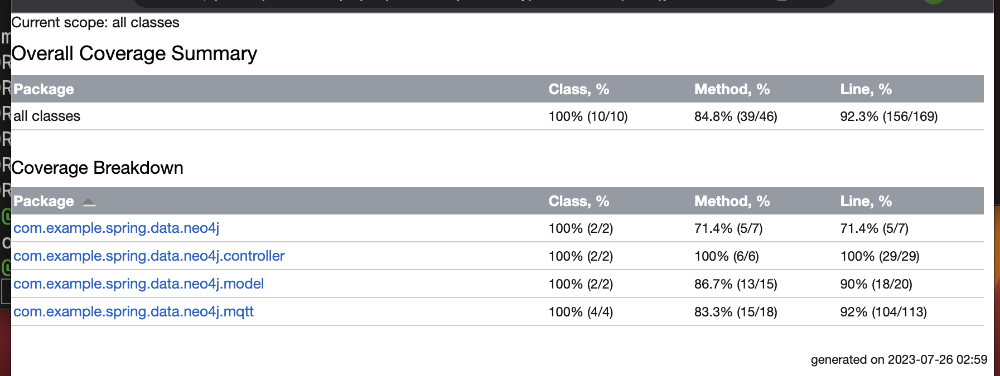

# Cloud Bootcamp

## Requirements
- mongodb 6.0.6
- Neo4j 5.10.0

## Mosquitto runs on
- tcp port 1883
- websockets port 9001

```bash
mosquitto -c mosquitto.conf
```
`mosquitto.conf`:
```
listener 1883
listener 9001
protocol websockets
allow_anonymous true
```

## Unit test coverage 85+

